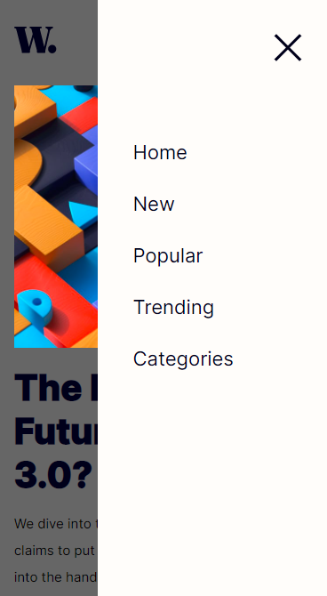

# Frontend Mentor - News homepage solution

This is a solution to the [News homepage challenge on Frontend Mentor](https://www.frontendmentor.io/challenges/news-homepage-H6SWTa1MFl). Frontend Mentor challenges help you improve your coding skills by building realistic projects.

## Table of contents

-   [Overview](#overview)
    -   [The challenge](#the-challenge)
    -   [Screenshot](#screenshot)
    -   [Links](#links)
-   [My process](#my-process)
    -   [Built with](#built-with)
    -   [What I learned](#what-i-learned)
    -   [Continued development](#continued-development)
    -   [Useful resources](#useful-resources)
-   [Author](#author)

**Note: Delete this note and update the table of contents based on what sections you keep.**

## Overview

### The challenge

Users should be able to:

-   View the optimal layout for the interface depending on their device's screen size
-   See hover and focus states for all interactive elements on the page
-   **Bonus**: Toggle the mobile menu (requires some JavaScript)

### Screenshot

### Links

-   Solution URL: [Repository](https://github.com/augustine-a8/frontend-mentor-news-homepage-main.git)
-   Live Site URL: [Go to site](https://augustine-a8.github.io/frontend-mentor-news-homepage-main/)

## My process

### Built with

-   HTML
-   CSS
-   JavaScript
-   Flexbox
-   Mobile-first workflow

### What I learned

I was able to build a responsive navbar for the first time using html, css and javascript. 🤗

### Continued development

Not totally confident in my implementation of the overlay when the mobile nav bar is open. I will have to look more into that

### Useful resources

-   [Responsive header design](https://youtu.be/HbBMp6yUXO0) - This is a tutorial from Kevin Powell on Youtube I followed to implement the responsive header.

## Author

-   Frontend Mentor - [@augustine-a8](https://www.frontendmentor.io/profile/augustine-a8)
